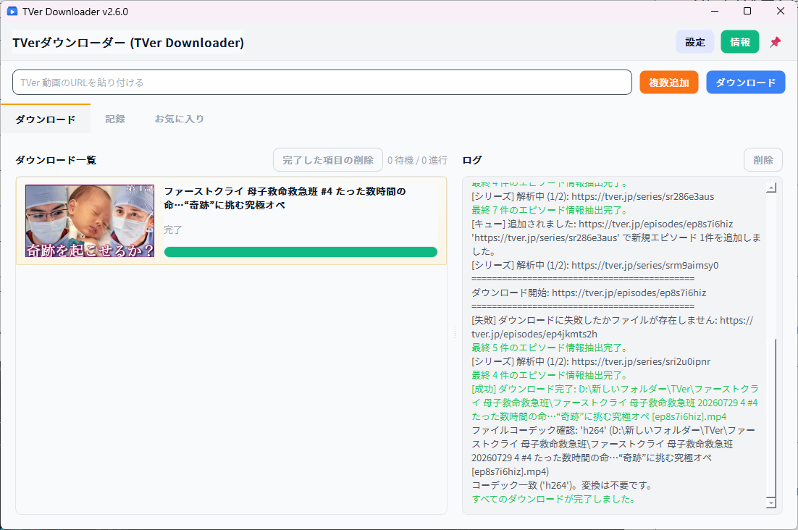

<p align="center">
  
</p>

<h1>
  
  TVer ダウンローダー (TVer Downloader)
</h1>

<a href="https://refer-nordvpn.com/RRXwGuSQXTe">
  
</a>
<a href="https://toon.at/donate/deuxdoom">
  
</a>

[](https://github.com/deuxdoom/TVerDownloader/releases/latest)
[](https://github.com/deuxdoom/TVerDownloader/releases/latest)
[](https://github.com/deuxdoom/TVerDownloader/releases)
[](https://opensource.org/licenses/MIT)<br>
[](https://github.com/deuxdoom/TVerDownloader)
[](https://www.python.org/)
[](https://pypi.org/project/PyQt6/)<br>
[](https://github.com/yt-dlp/yt-dlp)
[](https://ffmpeg.org/)

---

## 📜 概要

- **TVer Downloader** は日本の TVer で配信される動画をダウンロードするための GUI ベースのアプリです。<br>
- PyQt6 を使用した直感的なインターフェースと、yt-dlp / FFmpeg の自動更新機能を備えています。<br>
- 主に TVer の動画ダウンロードを目的としていますが、YouTube の動画でも動作します。<br>

---

## 💻 システム要件

- Windows 10 / 11 (x64)
- Python 3.10 以上
- インターネット接続が必要
- 日本国内向けサービスのため、日本の VPN 環境が必要になる場合があります
- 実行時エラーが発生する場合: [Microsoft Visual C++ 再頒布可能パッケージ (x64)](https://aka.ms/vs/17/release/vc_redist.x64.exe)

---

## ✨ 主な機能

- 最新の **yt-dlp** と **FFmpeg** の自動更新
- **単一 / 複数ダウンロード** をサポート（シリーズ URL の自動展開対応）
- **ファイル名のカスタマイズ** と出力順の設定
- **画質選択**（最高 / 1080p / 720p）
- **フォーマット変換**（MP4 → AVI / MOV、音声抽出）
- **サムネイルクリックで拡大表示**、**完了項目のダブルクリックで再生**
- **トレイ通知**、**常に最前面**、**進行状況表示とログ強化**
- **ライト / ダークテーマ切り替え**（初期値: ライト）
- **ダウンロード履歴とお気に入りシリーズの自動バックアップ**
- **ダウンロード後のフォルダを開く / シャットダウンなどの後続処理**
- **シンプルで使いやすい UI**、不要な機能を極力削減した設計

---

## 🚀 使い方

1. TVer の動画 URL を入力フィールドに貼り付けます
2. **設定** メニューで保存先、画質、同時ダウンロード数、ファイル名ルールなどを調整します
3. **ダウンロード** ボタンを押します
4. 進行状況、ログ、サムネイルで状態を確認します
5. **完了した項目** をダブルクリックして再生できます

---

## ❗ 注意事項

- 本アプリは **個人利用のアーカイブ目的** のみに使用してください。商用利用や再配布は禁止されています。
- TVer は日本国内向けサービスのため、**日本の VPN 環境** でのみ正常に動作する場合があります。
- ダウンロードしたコンテンツの **著作権と利用規約** を必ず遵守してください。
- **Windows で「PC を保護しました」や「未署名のファイル」警告** が出る場合があります。<br>
  このプログラムはオープンソースとしてビルドされたもので、悪意のあるソフトウェアではありません。
- **アップデート時は** `TVerDownloader.exe` **ファイルと** `_internal` **フォルダを一緒に上書きしてください。**

---

## 🔧 開発情報

- **GUI**: PyQt6  
- **ダウンロードエンジン**: yt-dlp + FFmpeg（自動最新化対応）  
- **設定保存**: JSON ベース（config / history）  
- **安定性**: 例外発生時にクラッシュログ (`TVerDownloader_crash.log`) を保存

---

## 📂 プロジェクト構成
```
📦 TVerDownloader
├─ 🐍 TVerDownloader.py                                        — エントリポイント / メインウィンドウの起動
├─ 📁 src
│  ├─ 🗂️ ui
│  │  └─ 🐍 main_window_ui.py                                   — メイン UI を構築 (ヘッダー、入力バー、タブ、トレイ)
│  ├─ 🧰 core
│  │  ├─ 🐍 download_manager.py                                 — キュー & 同時実行管理
│  │  ├─ 🐍 series_parser.py                                    — シリーズ URL 解析コーディネータ (キュー → スレッド)
│  │  ├─ 🐍 utils.py                                            — 設定、ファイル名テンプレート、ヘルパー（ファイルオープン、クラッシュログ）
│  │  └─ 🐍 updater.py                                          — GitHub releases/latest チェッカー
│  ├─ 💬 dialogs
│  │  ├─ 🐍 dialogs.py                                          — 設定ダイアログ（一般 / ファイル名 / 画質 / 後処理 / 高度 / キャッシュ）
│  │  ├─ 🐍 about_dialog.py                                     — アバウトウィンドウ（HTML 機能一覧）
│  │  ├─ 🐍 bulk_dialog.py                                      — 複数 URL 追加ダイアログ
│  │  └─ 🐍 series_dialog.py                                    — シリーズ選択ダイアログ（サムネイルプレビュー付き）
│  ├─ 🖼️ widgets
│  │  └─ 🐍 widgets.py                                          — ダウンロード / 履歴 / お気に入り項目ウィジェット + サムネイルキャッシュ
│  ├─ 🎞️ threads
│  │  ├─ 🐍 setup_thread.py                                     — yt-dlp & FFmpeg 自動セットアップ
│  │  ├─ 🐍 series_parse_thread.py                               — シリーズ解析 → エピソード一覧抽出
│  │  ├─ 🐍 download_thread.py                                   — ダウンロード + マージ + 字幕 + 進行解析
│  │  └─ 🐍 conversion_thread.py                                 — オプションのフォーマット変換
│  ├─ 🗃️ stores
│  │  ├─ 🐍 history_store.py                                    — urlhistory.json + ローリングバックアップ
│  │  └─ 🐍 favorites_store.py                                  — favorites.json + バックアップ
│  ├─ 🎨 theme
│  │  ├─ 🐍 qss.py                                              — ライト / ダーク QSS ビルダー
│  │  └─ 🐍 icon.py                                             — アプリアイコン (Base64 → QIcon)
│  └─ (optional) 📄 __init__.py                                  — モジュール化時のエントリ
├─ 🧾 実行時生成
│  ├─ 📄 downloader_config.json                                  — ユーザー設定
│  ├─ 📄 urlhistory.json                                         — ダウンロード履歴
│  ├─ 📁 thumbnails/                                             — キャッシュされたサムネイル
│  ├─ 📁 historybak/                                             — 履歴バックアップ
│  ├─ 📁 favoritbak/                                             — お気に入りバックアップ
│  └─ 📄 TVerDownloader_crash.log                                — クラッシュログ
└─ ⚙️ External tools (自動セットアップ)
   ├─ 📄 yt-dlp(.exe)
   └─ 📄 ffmpeg(.exe)
```
---

## 🤝 貢献と応援

- バグ報告・コード貢献: [Issues](https://github.com/deuxdoom/TVerDownloader/issues)  
- 開発者支援: [YouTube チャンネル登録](https://www.youtube.com/@LE_SSERAFIM?sub_confirmation=1)  
- ⭐ を押していただけると励みになります！

---
